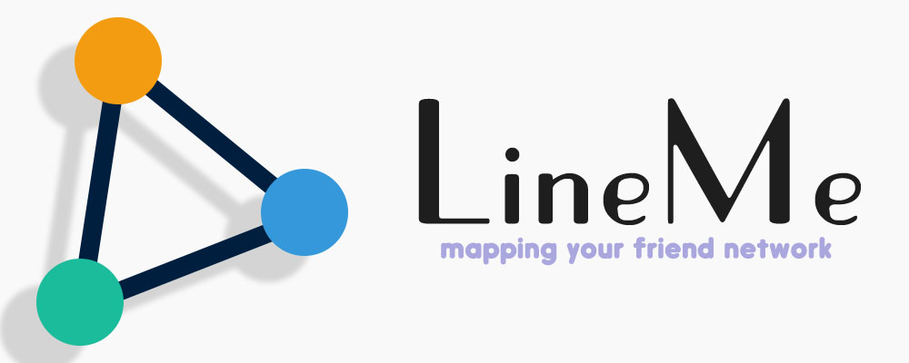

#  LineMe

LineMe is an offline social network data collecting website by d3.js, echart and django  
Idea from this [paper](http://dkroy.media.mit.edu/wp-content/uploads/sites/9/2016/02/Saveski_Chu_Vosoughi_Roy_WWW_2016.pdf)  
Location: http://lime.seeleit.com/
  
***

## Stack
* AdminLTE
* d3.js
* echart
* three.js
* iCheck
* hint.css
* animate.css
* input-mask
* Trip.js
* select2
* custom scrollbar
* cropit
* django
* django-htmlmin
* django-compressor
* csscompressor
* django-smtp-ssl
* networkx
* PostgreSQL
* Redis
* locust

## License
MIT

waiting...
